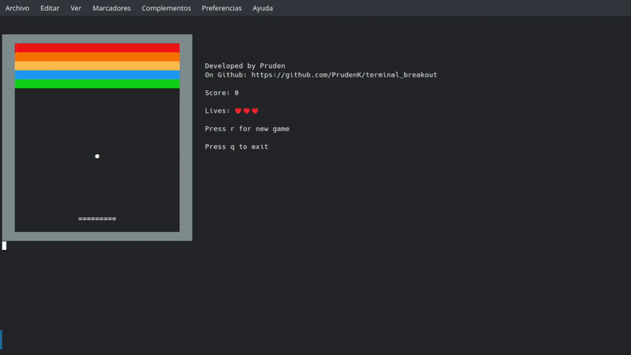

# 🧱 Terminal Breakout

**Terminal Breakout** es una implementación en **C++** del clásico **Breakout**, jugable desde la **terminal en Linux**.  
El juego está basado en un **grid discreto**, con lógica de colisiones por eje, sistema de vidas, puntuación y reinicio de partida.

---

## 🎮 Para jugar

### 🧩 Requisitos
- Linux
- CMake ≥ 3.16
- Compilador **C++** (gcc o clang, con soporte C++20)
- Terminal compatible con ANSI

### 🚀 Pasos

#### 1. 🔽 Clona el repositorio

    git clone https://github.com/PrudenK/terminal_breakout.git

#### 2. 📂 Entra al directorio del proyecto

    cd terminal_breakout

#### 3. 🛠️ Configura y compila

    mkdir build
    cmake -S . -B build
    cmake --build build

#### 4. ▶️ Ejecuta el juego

    ./build/terminal_breakout

---

## 🎯 Controles

- ← / → : mover la plataforma
- ESC : salir del juego
- r   : reiniciar partida
- q   : salir del juego

---

## 🧠 Mecánicas implementadas
- Movimiento fluido de la plataforma
- Rebotes estables con detección por eje
- Colisiones correctas en esquinas
- Sistema de **vidas**
- Sistema de **puntuación por bloques**
- Game Over y reinicio
- Renderizado completo en terminal

---

## 🖥️ Cómo se ve en el terminal

